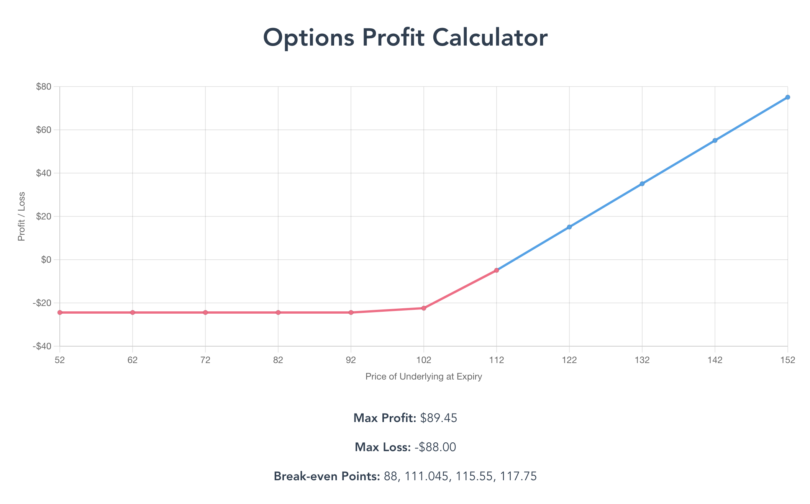
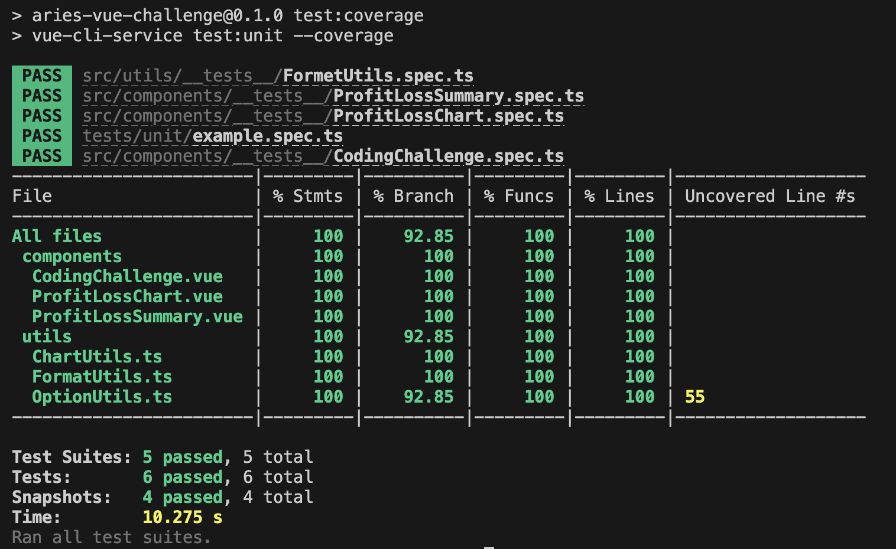

# Aries Financial Frontend Challenge

## Objective

Design and implement a front-end for options strategy risk and reward analysis using Vue.

## Brief

Your challenge is to create a Vue component that can generate a risk & reward graph for options strategies. The component should accept an input of up to four options contracts and output the following:

1. A risk & reward graph where X is the price of the underlying at the time of expiry and Y is the profit/loss at that price.
2. Max profit, max loss, and all break even points.

### Evaluation Criteria

- Completeness of the logic
- Usability of the graph
- Aesthetics of the UI
- Readability and code structure

### CodeSubmit

Please organize, design, test, and document your code as if it were
going into production - then push your changes to the main branch.

Reply to the invitation e-mail with your github username to notify of completion.

Have fun coding! 🚀
The Aries Financial Team

## Implementation

### Working Environment

- add `.prettierrc` to unify coding format
- update `package.json` and  for TypeScript support and Jest unit test
- introduce `tsconfig.json`, `src/shims-tsx.d.ts` and `src/shims-vue.d.ts` for TypeScript support

**Structures:**

```bash
/src
  │
  ├── assets # static assets
  │   └── logo.png
  │   └── ...
  │
  ├── components # presentational components
  │   └── CodingChallenge.vue
  │   └── ProfitLossChart.vue
  │   └── ProfitLossSummary.vue
  │   └── ...
  │
  ├── models # data models
  │   └── Option.ts
  │   └── ...
  │
  ├── utils # utility functions
  │   └── OptionUtils.ts
  │   └── ...
  │
  ├── App.vue
  ├── main.ts
  └── ...
```

### Implement Solution

- introduce `src/models/Option.ts` to utilize the enum and `Option` interface
- modify `src/App.vue` and `sampleData` to match with the `Option` interface
- introduce `src/utils/OptionUtils.ts` for the calculation of Profit/Loss and other data
- introduce `src/utils/FormatUtils.ts` for the formatting of the data
- ~the calculation may not be correct and need to be fine-tuned~

### Implement ChartJS

- add `vue-chartjs@4` to package.json
- introduce `src/utils/ChartUtils.ts` for general chart constants and functions
- implement `src/components/ProfitLossChart.vue` to display the chart using Line chart

### Implement UI

- `src/components/CodingChallenge.vue` is the main **Container** to display the chart and the summary Profit/Loss
- each component `ProfitLossChart` and `ProfitLossSummary` is responsible for the chart and the summary respectively



### Unit Testing Setup

- introduce `jest.config.js`, `jest.setup.js` for configuration
- update `.gitignore` to ignore `/coverage` directory

```bash
npm run test:unit
npm run test:coverage
```

### Implement Unit Test

- utilize `snapshot` testing to test all the components
- implement unit test for `FormatUtils`


