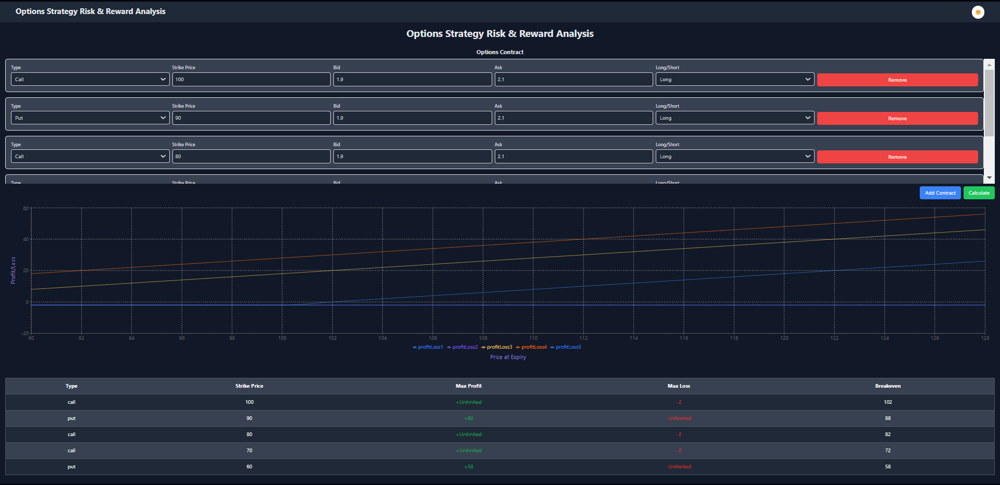

# Options Strategy Risk & Reward Analysis

This project is a React application designed to analyze the risk and reward of options trading strategies. The application allows users to input up to four options contracts and outputs a risk & reward graph, along with key metrics such as max profit, max loss, and breakeven points.

## Application Screenshot



## Features

- Input options contracts with details like type, strike price, bid, ask, and long/short.
- Calculate the premium based on bid and ask prices.
- Generate a risk & reward graph showing profit/loss at different prices of the underlying asset.
- Display key metrics in a table format.

## Prerequisites

- Node.js (version 14.x or later)
- npm (version 6.x or later) or yarn (version 1.x or later)

## Getting Started

### Clone the Repository

```sh
git clone https://github.com/RushikeshGandhmal/aries-react-challenge.git
cd aries-react-challenge
```

### Install Dependencies

Using npm:

```sh
npm install
```

Or using yarn:

```sh
yarn install
```

### Run the Application

Using npm:

```sh
npm run dev
```

Or using yarn:

```sh
yarn dev
```

The application should now be running on [http://localhost:5173/](http://localhost:5173/).

## Project Structure

- `src/components`: Contains the React components used in the application.
- `src/constants`: Contains constants used across the application, such as default option values.
- `src/types`: Contains TypeScript type definitions.
- `src/utils`: Contains utility functions for calculations.
- `src/App.tsx`: The main application component.
- `src/main.tsx`: The entry point of the application.
